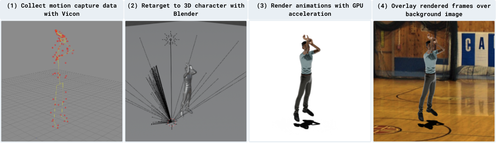

# MIME Creation Pipeline 



### Ingredients

- Blender 4.3.0 (Install Blender 4.3.0 from [here](https://www.blender.org/download/releases/4-3/).
)
- Mocap data 
- Mixamo characters 
- Background images 

To replicate creating MIME, download mocap data, Mixamo characters, and background images from this [link](https://drive.google.com/file/d/1Y3cI_syRX15GJYcjJFI9NCZsDWm0Y1IP/view?usp=sharing) and place the decompressed contents in the `data` directory such that the structure is:
```
data/
├── mocap_j/
├── mocap_n/
├── mixamo_avatars/
├── background/
```


### (Optional) Setting up Blender on USC's CARC with apptainer 
```bash
# first get a gpu node allocated (e.g., salloc -p gpu --gres=gpu:v100:1 --mem 16GB --time 4:00:00 --cpus-per-task=8)
module load apptainer
unset TMPDIR # apptainer needs to leverage the default TMPDIR
apptainer pull docker://linuxserver/blender:version-4.3.0 # if not already done before 
apptainer shell --nv blender_version-4.3.0.sif # # enter apptainer shell, use --nv flag to access GPU 
```

### Creating `.blend` files to render 

```bash
cd /path/to/project/mime # from within the shell if using apptainer 
blender -b -P blender_scripts/install_addons.py # install the necessary addons (rokoko and cats), may need to be run twice if the first time fails
blender -b -P blender_scripts/create_blender.py # create .blend files (takes ~10 mins) in data/blend_files  
```

### Submit render jobs 

Complete jobs in parallel. This will create frames with a transparent background in `data/videos_transparent`. 

```bash 
# Example 
sbatch submit_render_job.sh 1 100 8 man*angle0* # render the first 100 blend files in the blend_files directory in parallel with 8 jobs that matches the pattern man*angle0*
```

### Create videos from frames 

```bash
# Usage: `./create_videos_from_frames.sh <background_config:str: [blank, aligned, misaligned]> <pattern:str: pattern to match the folders containing frames in data/videos_transparent> <reverse:bool: whether to reverse the order of folders that have been found that matches the given pattern>`
./create_videos_from_frames.sh blank man*angle0* false # --> create videos from frames that matches the pattern man*angle0* with the blank background. 
```

### Create Huggingface dataset 

```bash
python src/MimeEval/utils/create_data_jsonl.py
# This will create the following files:
# - data/mime_data_legacy.jsonl: the mime data in the huggingface format
# - data/real_data_legacy.jsonl: the real data in the huggingface format
# - data/MIME/cropped_videos/test/metadata.csv: the cropped videos of the mime data
# - data/MIME/videos/test/metadata.csv: the original videos of the mime data
# - data/MIME/resized_videos/test/metadata.csv: the resized videos of the mime data
# - data/REAL/videos/test/metadata.csv: the original videos of the real data
```

```bash
python src/MimeEval/utils/download_videos.py --dataset_path data/mime_data_legacy.jsonl --videos_dir data/MIME/videos/test
python src/MimeEval/utils/download_videos.py --dataset_path data/real_data_legacy.jsonl --videos_dir data/REAL/videos/test
# This will download the videos from the huggingface dataset to data/MIME/videos/test and data/REAL/videos/test


python src/MimeEval/utils/crop_videos.py --dataset_dir data/MIME 
# This will crop the videos to 640x480 and save them to data/MIME/cropped_videos/test

python src/MimeEval/utils/resize_videos.py --dataset_dir data/REAL
# This will resize the videos to 640x480 and save them to data/REAL/resized_videos/test

python src/MimeEval/utils/make_huggingface_dataset.py
# This will create the huggingface dataset in the data/MIME and data/REAL directories (need to be run after creating relevant data repositories on huggingface (i.e., <user name>/mime-original, <user name>/mime-cropped, <user name>/mime-real-resized, <user name>/mime-real-original) and changing the user name in this script)
```

### Misc. 

- `bash_scripts/commands.sh` contains all the commands to run the pipeline. 
- `bash_scripts/submit_render_job.sh` is a script that submits render jobs in parallel. 
- `bash_scripts/create_videos_from_frames.sh` is a script that creates videos from frames by combining frames with background images. It also uploads the videos to s3. 
- `bash_scripts/check_video_correct.sh` is a script that checks if all the videos on s3 contain the correct number of frames as specified by their corresponding .blend file. 
- `bash_scripts/correct_naming.sh` is a script that corrects the naming of the png files (frames_###.png to frame_####.png)
- `bash_scripts/check_png.sh` is a script that checks for corrupted png files and deletes them. 
- `blender_scripts/rotate_camera.py` is a script that rotates the camera angle of a blend file. 
- `blender_scripts/video2image.py` is a script that creates an image from a video that stitches multiple images horizontally or vertically. 
- `blender_scripts/find_start_end_frames.py` is a script that finds the start and end frames of a mocap file.
- `blender_scripts/set_render_configs.py` is a script that sets the render configurations for the blend files.
- `blender_scripts/overlay_video_on_background.py` is a script that overlays frames of a video with transparent background on a background image.
    - Usage: `python overlay_video_on_background.py -f <path to directory with frames> -b <path to background image> -o <output_path>`
    - This will create a .mp4 video with the overlayed video.
- `data/filtered_mocap_info.csv`: motion capture data filter results are from [Google Sheet](https://docs.google.com/spreadsheets/d/1HkQ3V4X-CqsBqe5au6t2v6pbxfwW1hKty5G2uLR6ZEk/edit?gid=1451100799#gid=1451100799). 
- `data/initial_annotations.jsonl`: initial annotations for the MIME dataset to consolidate labels among initial annotators
    - These are consolidated with `data/consolidate_labels.py` and used by `src/MimeEval/utils/create_data_jsonl.py` to create the legacy dataset that was used prior to huggingface format. 