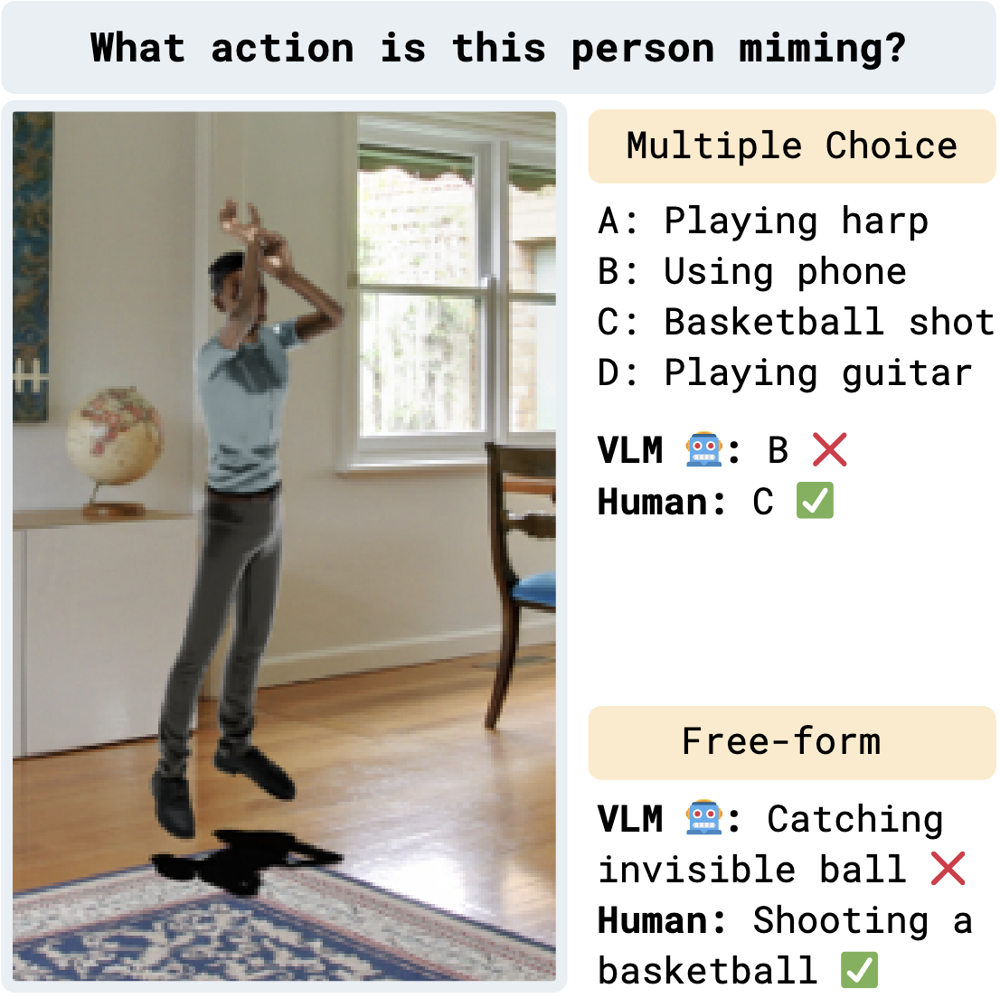
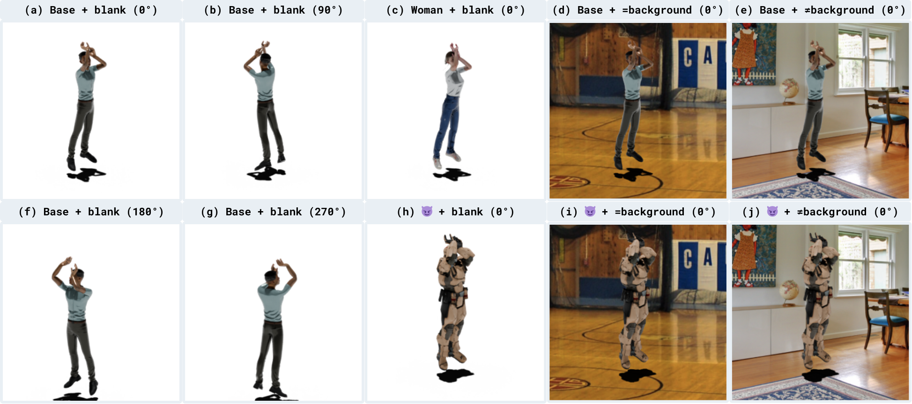

# MIME: Mime Identification Multimodal Evaluation 

[](https://huggingface.co/datasets/wise-east/mime-cropped)
[](https://opensource.org/licenses/Apache-2.0)




- **📹 [Watch Sample Video](https://mime-understanding.s3.amazonaws.com/man_j_Basketball001_angle0_living_room.mp4)**
- Watch more videos on [AWS S3](https://mime-understanding.s3.amazonaws.com/index.html)

### Overview

This is the official repository for the paper "[Can Vision Language Models Understand Mimed Actions?](https://justin-cho.com/mime)" and the MIME benchmark. 


MIME contains 86 animated videos, each with 8 different variants for systematically analyzing recognition robustness of mimed actions. 

Refer to our project page for more details: [https://justin-cho.com/mime](https://justin-cho.com/mime)

### Hugging Face Dataset options

- [`wise-east/mime-cropped`](https://huggingface.co/datasets/wise-east/mime-cropped): cropped videos with 8 variants (what we use in our paper)
- [`wise-east/mime-real-resized`](https://huggingface.co/datasets/wise-east/mime-real-resized): resized REAL videos with 8 variants  (what we use in our paper)
- [`wise-east/mime-original`](https://huggingface.co/datasets/wise-east/mime-original): original MIME videos without cropping 
- [`wise-east/mime-real-original`](https://huggingface.co/datasets/wise-east/mime-real-original): original REAL videos without resizing

`mime-original` and `mime-real-original` are also available on [AWS S3](https://mime-understanding.s3.amazonaws.com/index.html).


### Variants in MIME




### Environment Setup

```bash
conda create -n mime python=3.11
conda activate mime
pip install -e . 
```


### Evaluating on MIME 

```bash
mimeeval run <mcq,ff> --dataset-name <dataset_name> \
    --model-name <model_name> --model <model_type> \
    --api-key <api_key> --eval-type <eval_type>  --variant <variant>

# Example 
mimeeval run mcq --dataset-name wise-east/mime-cropped \
    --model-name Qwen/Qwen2.5-VL-7B-Instruct --model qwen25vl \
    --api-key none --eval-type zero-shot --variant all
```

You can use `run_eval.sh` for convenience for replicating results from the paper.
- Example: `./run_eval.sh wise-east/mime-cropped all zero-shot mcq qwen3b`
    - This will run zero-shot MCQ evaluation on all variants of the MIME dataset using Qwen2.5-VL-3B-Instruct. 
- See `commands.sh` for all commands that were used for the paper. 


#### Models currently supported are in `src/MimeEval/models/`: 
- OpenAI (gpt-4o-mini)
- Gemini (gemini-1.5-flash)
- Qwen (Qwen2.5-VL-3B-Instruct, Qwen2.5-VL-7B-Instruct, Qwen2-VL-3B-Instruct, Qwen2-VL-7B-Instruct)
- InternVL (InternVL2_5-8B)
- Phi 3.5

Refer to the implementations in `src/MimeEval/models/` to add support for custom models. 

### Creating MIME 

Refer to [MIME_pipeline_README.md](MIME_pipeline_README.md) for details on how to create the datasets. 
It contains information on where all the digital assets (motion capture data, background images, Mixamo characters, etc.) needed for creating MIME are stored. 

###  Miscellaneous Scripts 

- Raw human evaluation results: `results/mime-cropped/human_eval.jsonl` and `results/mime-real-resized/human_eval.jsonl`
- Compute human evaluation results: `python src/MimeEval/utils/compute_human_eval_results.py`
- `aggregate.py`: aggregate results from different models and datasets to produce tables/figures in the paper. 

### Contact 

Reach out to [Justin Cho](https://justin-cho.com) for any questions or open an issue. 

### Citations

```bibtex
@misc{cho2025visionlanguagemodelsunderstand,
    title={Can Vision Language Models Understand Mimed Actions?}, 
    author={Hyundong Cho and Spencer Lin and Tejas Srinivasan and Michael Saxon and Deuksin Kwon and Natali T. Chavez and Jonathan May},
    year={2025},
    eprint={2506.21586},
    archivePrefix={arXiv},
    primaryClass={cs.CL},
    url={https://arxiv.org/abs/2506.21586}, 
}
```